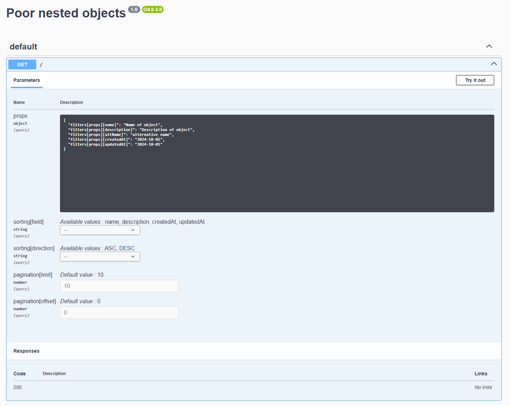
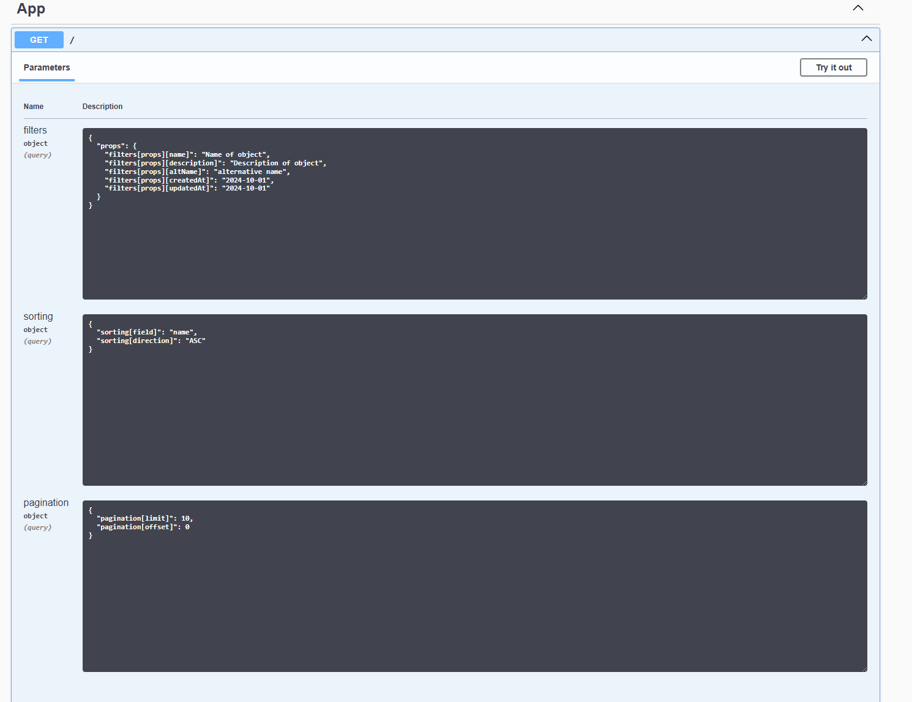

# The bug

NestJS Swagger 8 introduced a regression regarding parsing of complex objects.

Source object schema is located in `./src/demonstration.dto.ts`.

## NestJS Swagger 7

Here's how that object looked in the previous major version.


Perhaps not that pretty, but it works for my usecase and passes validation by default.

## NestJS Swagger 8

If we run

```bash
npm install @nestjs/swagger@8
```

The display changes:


It doesn't seem like Swagger knows what's happening in those nested objects and just treats them as plain ones.
